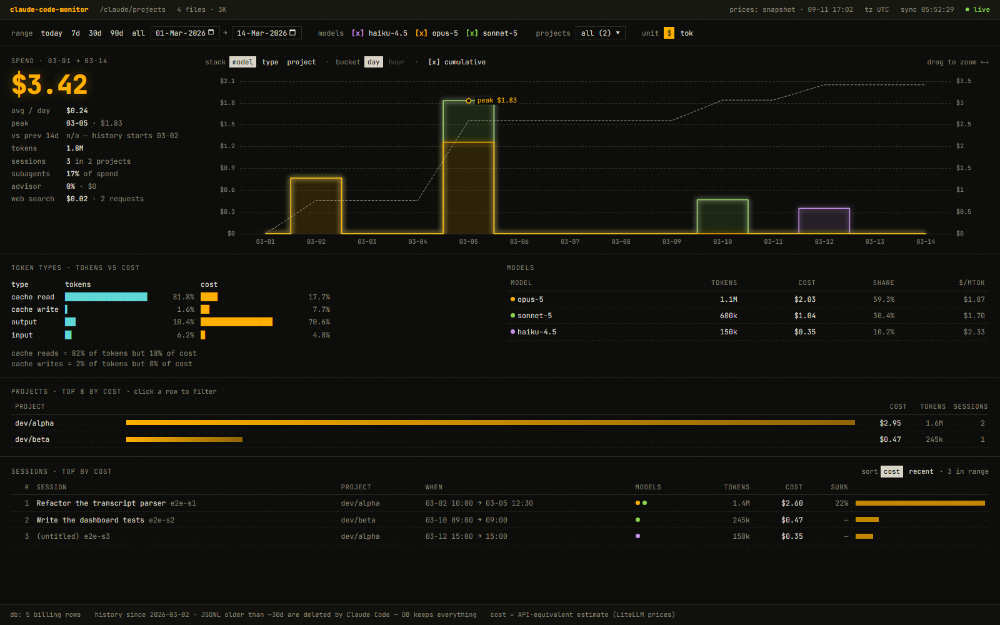

# claude-code-monitor

An always-on local dashboard for Claude Code and OpenAI Codex token usage and API-equivalent cost.

It reads the JSONL transcripts that Claude Code writes under `~/.claude/projects` and, when Codex is installed, the rollout
files Codex writes under `~/.codex/sessions`. It keeps the history in SQLite (Claude Code deletes transcripts after about 30
days by default) and prices every call with LiteLLM's public price list, the same source ccusage uses.

> claude-code-monitor is an independent, unofficial project. It is not affiliated with, endorsed by or sponsored by Anthropic
> or OpenAI. Claude and Claude Code are trademarks of Anthropic, PBC. OpenAI and Codex are trademarks of OpenAI.



## Features

- **Status bar**: transcript source, files and size, price source and age, time zone, last sync, `● live` or backfill progress,
  and warnings for a missing source, unpriced models and skipped data.
- **Filters**: range presets `today 7d 30d 90d all` or custom dates, model checkboxes (also the chart legend), a searchable
  project picker, a `claude / codex` client switch when both have data, and a `$ / tok` unit switch.
- **Spend**: total for the period, average per day, peak, change against the previous period, tokens, sessions, subagent and
  advisor shares, and web-search fees when there are any.
- **Timeline**: stepped stacked areas by model, token type, project or client, day or hour buckets, and a cumulative line. Drag
  across the chart to narrow the range; the browser's Back button undoes it.
- **Token types, models, projects, sessions**: token and cost shares per token type, cost per million tokens per model, the top
  8 projects (click one to filter), and the top 50 sessions by cost or recency.
- **Codex limits**: the newest rate-limit reading Codex logged: plan, usage of each window and when it resets. A window that
  has reset since the reading is marked as such.
- **Claude limits**: Claude subscription usage of the 5-hour and weekly windows (and a gateway spend limit) with reset times,
  recorded by a small status line tap (see [Claude limits](#claude-limits)).
- **Shareable views**: everything the page shows is kept in the URL (`range` or `from`/`to`, `models`, `projects`, `clients`,
  `unit`, `stack`, `bucket`, `cum`, `sort`), so a view can be bookmarked.
- **Live**: the page polls `/api/status` every 30 seconds and reloads when new transcript lines or new prices arrive.

## Quick start (Docker)

Prerequisites: Docker Desktop, or Docker Engine with the Docker Compose plugin (`docker compose`). Either way, Docker Compose
must be 2.24 or later (`docker compose version`).

Clone this repository, then in its directory:

```bash
cp .env.example .env
# Edit .env: set CLAUDE_HOME to your Claude Code directory (the one that contains "projects"),
# CODEX_HOME to your Codex directory if you use Codex (the one that contains "sessions"),
# and TZ to your time zone, for example TZ=America/New_York.
docker compose up -d --build
curl http://127.0.0.1:8739/healthz
```

Then open http://127.0.0.1:8739 (or your `MONITOR_PORT`) in a browser.

- The image is built locally from this repository; there is no published registry image.
- On Linux, create the Codex folders as your own user before the first start, for example
  `mkdir -p ~/.codex/sessions ~/.codex/archived_sessions` (use the path you set as `CODEX_HOME`). Docker creates a missing
  mount folder owned by root, and Codex could then not write to it. Without `CODEX_HOME`, Compose mounts two empty folders
  under `./.codex-none` instead; git ignores that folder.
- On Linux, also create `~/.claude/claude-code-monitor` (under your `CLAUDE_HOME`) before the first start, for the same
  reason: the status line tap writes the Claude limits there.
- The first start backfills every available transcript; the status bar and `GET /api/status` (`backfill`) show the progress.
  After that, only appended bytes are read every `SCAN_INTERVAL_SEC`.
- History lives in the `claude-code-monitor_monitor-data` volume, and the transcript directories are mounted read-only. Once
  Claude Code has deleted old transcripts, the volume is the only copy of that usage: back it up (see [Operations](#operations))
  and keep it on a named volume, because SQLite's write-ahead log can misbehave on a bind-mounted Windows folder.

## Privacy

- Everything runs on your machine, and the transcript directories are mounted read-only.
- The database stores token counts, message, session and agent ids, model names, timestamps, project paths (working
  directories) and the session titles Claude Code generates. It never stores prompt or response text. Session titles are
  derived from your prompts, so treat the database as private.
- The only outbound request is a plain GET of the public LiteLLM price list. No usage data leaves the machine.
- Logs never contain transcript content. File paths appear only in warning and debug messages.
- From Codex rollouts the database stores response, thread and session ids, model names, timestamps, token counts, the
  working directory and the latest rate-limit reading (plan, window usage, reset times, credit balance). Codex prompts,
  responses and thread names are never stored.
- The Claude limits file holds only window usage percentages and times. The tap reads the status line input Claude Code
  already passes to your status line and writes nothing else.

## Security

- There is **no authentication**. Anyone who can reach the port can read everything the dashboard shows, including session
  titles and project paths.
- The compose file publishes the port on `127.0.0.1` only. Keep that prefix. Never run the image with `-p 8739:8739` or
  `--network host`. On Linux, ports published by Docker bypass ufw rules.
- For remote access, use an SSH tunnel (`ssh -L 8739:127.0.0.1:8739 you@host`, then open http://127.0.0.1:8739) or an
  authenticating reverse proxy, and add the proxy's hostname to `ALLOWED_HOSTS`.
- The server answers only the hostnames `localhost`, `127.0.0.1`, `[::1]` and the `ALLOWED_HOSTS` entries. This blocks DNS
  rebinding from web pages. It is **not** access control: any client that reaches the port can send `Host: localhost`.
- API requests that a browser marks as cross-site or same-site (`Sec-Fetch-Site`) get a 403, the Content Security Policy allows
  only the page's own scripts, and every endpoint is a read-only GET.
- Outside Docker, a new database file gets mode 0600, and a data directory the service has to create gets mode 0700. An existing
  database keeps its mode; run `chmod 600 data/monitor.db*` to tighten it.
- Under the compose file, the container runs as the non-root `node` user with a read-only root filesystem, no Linux capabilities
  and `no-new-privileges`. Only Claude Code's `projects` and `claude-code-monitor` folders and Codex's `sessions` and
  `archived_sessions` folders are mounted, so neither tool's credentials enter the container.

## Configuration

| Variable                | Default                                                                               | Under Docker Compose                                     | Description                                                                                                                                                           |
| ----------------------- | ------------------------------------------------------------------------------------- | -------------------------------------------------------- | --------------------------------------------------------------------------------------------------------------------------------------------------------------------- |
| `PORT`                  | `8739`                                                                                | pinned to `8739`                                         | HTTP port                                                                                                                                                             |
| `HOST`                  | `127.0.0.1`                                                                           | pinned to `0.0.0.0`                                      | Bind address; compose publishes the port on `127.0.0.1` only                                                                                                          |
| `ALLOWED_HOSTS`         | empty                                                                                 | from `.env`                                              | Extra hostnames the server answers besides `localhost`, `127.0.0.1` and `[::1]`: comma-separated, no scheme or port. Not access control                               |
| `CLAUDE_PROJECTS_DIRS`  | `~/.claude/projects`                                                                  | pinned to `/claude/projects`                             | Comma-separated transcript roots; a root inside another root is dropped                                                                                               |
| `CODEX_HOME`            | `~/.codex`                                                                            | host path from `.env`; pinned to `/codex` inside         | Comma-separated Codex homes (one path under Docker Compose). Their `sessions` and `archived_sessions` folders are read when they exist; a missing one is not an error |
| `CLAUDE_LIMITS_FILE`    | `claude-code-monitor/rate-limits.json` next to the first `CLAUDE_PROJECTS_DIRS` entry | pinned to `/claude/claude-code-monitor/rate-limits.json` | The status line tap's file (see [Claude limits](#claude-limits)). A missing file shows no Claude limits                                                               |
| `DB_PATH`               | `./data/monitor.db`                                                                   | pinned to `/data/monitor.db`                             | SQLite database file                                                                                                                                                  |
| `SCAN_INTERVAL_SEC`     | `60`                                                                                  | from `.env`                                              | Rescan interval in seconds (10-3600)                                                                                                                                  |
| `TZ`                    | the host time zone (`UTC` if unknown)                                                 | from `.env`, `UTC` when unset                            | IANA time zone for daily buckets, for example `Europe/Kyiv` or `America/New_York`. Changing it later is safe: stored days are recomputed                              |
| `PRICING_URL`           | LiteLLM's `model_prices_and_context_window.json`                                      | from `.env`                                              | Price source. Must be an `https:` URL; `http:` is accepted only for `localhost`, `127.0.0.1` and `[::1]`                                                              |
| `PRICING_REFRESH_HOURS` | `24`                                                                                  | from `.env`                                              | Price refresh period in hours (1-168)                                                                                                                                 |
| `LOG_LEVEL`             | `info`                                                                                | from `.env`                                              | pino log level: `fatal`, `error`, `warn`, `info`, `debug`, `trace` or `silent`                                                                                        |
| `CLAUDE_HOME`           | —                                                                                     | required                                                 | Compose only: absolute path of the Claude Code directory that contains `projects`                                                                                     |
| `MONITOR_PORT`          | `8739`                                                                                | optional                                                 | Compose only: host port, published on `127.0.0.1`                                                                                                                     |

Under Docker Compose, set everything in `.env`. Compose reads `CLAUDE_HOME`, `CODEX_HOME` and `MONITOR_PORT` from `.env` or
from your shell, but every other setting, `TZ` included, reaches the container only through `.env`: a variable exported in
your shell does not.

## Cost estimate

Cost is an API-equivalent estimate: tokens times LiteLLM's current per-token prices, computed when you look, not stored.

- Input, output, cache reads, 5-minute cache writes and 1-hour cache writes are priced separately. Fast mode applies the
  model's fast-mode multiplier.
- Advisor calls are billed at the advisor model's own price. ccusage does not count them, so for the same transcripts the
  monitor shows a higher total than ccusage. The difference is the advisor spend, which the hero's `advisor` row shows; on
  advisor-heavy use it is often 5-10% of the total.
- Failed attempts before a model fallback are billed at their own model.
- Web search costs $0.01 per request when the transcript records the request (`usage.server_tool_use.web_search_requests`).
  The fee is attributed to the model that made the call and is left out of `$/Mtok`.
- Claude Code's own WebSearch tool runs the search in a separate side request, on a small Haiku model, and that request is not
  written to the transcripts. So the web-search count is usually 0 even if you search a lot, and neither those searches nor
  their tokens can be counted by the monitor or by any other tool that reads transcripts. The same holds for Claude Code's
  other internal side calls, which is why its own cost counter can be higher than a transcript-based estimate.
- Not included: long-context tiers (above 200k input tokens for Claude, above 272k for OpenAI; base rates are used at any
  context length), Codex priority processing, and regional pricing multipliers.
- Prices are refreshed every `PRICING_REFRESH_HOURS`; when LiteLLM cannot be reached, an embedded snapshot is used. When prices
  change, the whole history is re-priced, as in ccusage.
- Models without a price count as $0 and are listed in the status bar and in `/api/status` (`pricing.unpricedModels`).

## How it works

`scan → incremental read → parse → SQLite → costing view → HTTP API → dashboard`

- Every `SCAN_INTERVAL_SEC`, the scanner lists the `*.jsonl` files under each root, subagent transcripts included, without
  following symbolic links. It reads only the bytes appended since the last scan. A file that shrank, or whose first kilobyte
  changed, is read again from the start.
- The parser keeps assistant lines that carry `message.usage`, and the `ai-title` lines with session titles. Everything else,
  prompts and responses included, is ignored.
- One API response can be written several times: streamed updates and copies in subagent transcripts. Rows are keyed by message
  id, row kind and iteration index. When copies collide, a main-conversation copy wins over a sidechain copy; otherwise the
  copy with more tokens wins.
- Advisor calls appear in `usage.iterations[]` as `advisor_message` entries with their own model, and each becomes its own row.
  The line's top-level usage covers only the main model, so nothing is counted twice; the monitor checks this on every such
  line.
- When a model fallback happened (a `fallback_message` iteration), the `message` iterations are the failed attempts and are
  stored as rows of their own.
- Cache writes are split into 5-minute and 1-hour writes (`usage.cache_creation`). A line without that breakdown counts all
  its cache writes as 5-minute writes.
- Lines with the model `<synthetic>` (messages Claude Code writes itself) and API-error lines are ignored.
- Input is bounded: token counts are integers up to one billion, timestamps fall between 2023-01-01 and one day from now, ids
  and model names have at most 200 characters, a `cwd` over 4096 characters counts as unknown, titles are cut to 500
  characters, a line with more than 100 usage iterations is skipped, and a line over 64 MiB is skipped.
- A session's project is the working directory of its earliest main-conversation line, or of a subagent line when there is no
  main one.
- SQLite keeps one row per billed call. A view multiplies the tokens by the current prices, so the API always prices history
  with the current table. Each row also has a local day in `TZ`, recomputed when `TZ` changes.
- Data problems show up in the status bar: `⚠ N lines skipped`, `⚠ N iterations dropped` and
  `⚠ advisor usage check failed (N)`.

## Codex

- **Sources.** Codex writes one rollout file per thread under `CODEX_HOME/sessions/YYYY/MM/DD/` and moves it to
  `CODEX_HOME/archived_sessions/` when the thread is archived. Both folders are read; a file that moved is counted once.
- **What is counted.** Each `token_usage_record` line is one billed model response, keyed by its response id. Cumulative
  `token_count` lines are not used for tokens: Codex writes them again with the same totals, copies them into subagent
  threads, and writes them into sessions it imports from other agents. They only provide the rate-limit reading.
- **Codex version.** Codex writes `token_usage_record` lines since its builds of 2026-08-31. Older rollout files carry only
  `token_count` lines, so their usage does not appear.
- **Tokens.** `input_tokens` includes cached and cache-write tokens, and `output_tokens` includes reasoning tokens. The monitor
  stores uncached input, cache reads, cache writes and output separately, and prices them with the model's LiteLLM rates.
  Where LiteLLM publishes no cache rate for an OpenAI model, cached tokens are priced as input.
- **Subagents and auto-review.** A subagent thread (spawned agents, the `codex-auto-review` guardian) counts toward the
  session that started it and shows in the `subagents` share. `codex-auto-review` has no LiteLLM price and counts as $0.
- **Model.** A response gets the model of its turn (`turn_context`).
- **Projects.** A Codex session's project is its working directory, so a directory you use with both tools is one project.
- **Compared with ccusage.** ccusage reads `token_count` lines, which leave out context-compaction requests. The monitor
  counts them, so its Codex token total can be up to about 1% higher. ccusage also prices a model that has no LiteLLM
  price, such as `codex-auto-review`, at the rates of a fallback model, so its Codex cost can be noticeably higher.
- **Not shown.** Thread names; the cost is an API-equivalent estimate, not ChatGPT plan credits.

## Claude limits

Claude Code does not write its subscription rate limits to disk. It passes them only to your status line command, as the
`rate_limits` field of the JSON on stdin (Pro and Max plans, after the first model response of a session). The tap
`scripts/claude-limits-tap.mjs` records them for the monitor:

- It reads the status line input, keeps the highest usage seen in each window in
  `${CLAUDE_CONFIG_DIR:-~/.claude}/claude-code-monitor/rate-limits.json`, and writes the input to stdout unchanged, so your
  existing status line keeps working.
- It needs Node.js 22.12 or later on the host and has no dependencies. A failure is printed on stderr; the status line
  still gets its input.
- Several sessions share one file. Within one window the higher usage wins, so an idle session that redraws its status line
  with older numbers cannot lower the reading; a later reset time starts a new window.

Set it up in `~/.claude/settings.json`. With another status line command, put the tap in front of it:

```json
{
  "statusLine": {
    "type": "command",
    "command": "node /path/to/claude-code-monitor/scripts/claude-limits-tap.mjs | <your status line command>"
  }
}
```

Without one, use `--standalone`, which prints a short summary such as `5h 23% · weekly 41%` instead of the input:

```json
{ "statusLine": { "type": "command", "command": "node /path/to/claude-code-monitor/scripts/claude-limits-tap.mjs --standalone" } }
```

On Windows, Claude Code runs the command through Git Bash when it is installed: write paths with forward slashes
(`C:/Users/you/claude-code-monitor/scripts/claude-limits-tap.mjs`), and use the full path to `node` if it is not on the
Git Bash `PATH`.

The dashboard shows the `claude limits` block once the file exists. A window whose reset time has passed shows
`reset · no newer data` until a session reports it again. To clear a window that is no longer reported, delete the file;
the tap writes a new one on the next reading.

Claude Code does not show the tap's error messages in the status line. If the block never appears, run `claude --debug`,
which logs the exit code and stderr of the first status line run in a session, or run the command by hand with a sample
input and read the error it prints:

```bash
echo '{"rate_limits":{"five_hour":{"used_percentage":1,"resets_at":1000000000}}}' | node /path/to/claude-code-monitor/scripts/claude-limits-tap.mjs --standalone
```

On Linux the usual cause is a `claude-code-monitor` folder that Docker created as root. When the file exists but cannot
be used, the monitor logs a warning (`docker compose logs claude-code-monitor`). Under Docker Compose, the folder is
mounted read-only from `CLAUDE_HOME`; outside Docker, set `CLAUDE_LIMITS_FILE` if your Claude Code directory is not the
parent of the first `CLAUDE_PROJECTS_DIRS` entry.

## Operations

**Upgrade.** Back up first (below), then:

```bash
git pull
docker compose up -d --build
```

On Linux, when you upgrade from a version without Claude limits, first create `~/.claude/claude-code-monitor` (under your
`CLAUDE_HOME`) as your own user; see [Claude limits](#claude-limits).

A new version may migrate the database on its first start. An older image refuses a database that a newer one has migrated
(`database schema version N is newer than this build supports`), so to roll back, restore the backup you took before the
upgrade and start the older version.

**Backup.** The whole history is one SQLite file in the `claude-code-monitor_monitor-data` volume. Stopping the container first
lets the service close the database cleanly, so the copied file is complete on its own:

```bash
docker compose stop
docker cp claude-code-monitor:/data/monitor.db ./monitor-backup.db
docker compose start
```

**Restore.** With the container stopped, copy the backup in as the container's own user and remove any leftover journal files:

```bash
docker compose stop
docker compose run --rm --no-deps --name claude-code-monitor-restore \
  -v "$PWD/monitor-backup.db:/backup/monitor.db:ro" claude-code-monitor \
  sh -c 'cp /backup/monitor.db /data/monitor.db && rm -f /data/monitor.db-wal /data/monitor.db-shm'
docker compose start
```

On Windows in Git Bash, prefix the `docker compose run` line with `MSYS_NO_PATHCONV=1` and write
`"$(pwd -W)/monitor-backup.db:/backup/monitor.db:ro"`. In PowerShell, end the continued lines with a backtick (`` ` ``) instead
of `\`, or put the `docker compose run` command on one line; `$PWD` then works as written.

(`docker cp` into a container would create a root-owned file that the service cannot write.)

**Uninstall.** `docker compose down` removes the container and keeps the history volume. `docker compose down -v` also deletes
the volume, and with it the whole history permanently, including usage whose transcripts Claude Code has already deleted.
`docker image rm claude-code-monitor:local` removes the image.

**Health.** `GET /healthz` answers 503 when the database is unavailable or when ingest has made no progress for more than 10
scan intervals. The image's health check uses it, so `docker ps` shows the container as unhealthy.

## API

| Endpoint                                                         | Description                                                                                                          |
| ---------------------------------------------------------------- | -------------------------------------------------------------------------------------------------------------------- |
| `GET /healthz`                                                   | `{ ok, lastSyncAgeSec }`: 200 when healthy, 503 when the database or ingest has a problem                            |
| `GET /api/status`                                                | Sync and backfill progress, sources, pricing freshness, data bounds, data warnings, and Claude and Codex rate limits |
| `GET /api/filters`                                               | Models, projects and date bounds for the filters                                                                     |
| `GET /api/overview?from&to&models&projects&clients&bucket&stack` | Totals, time series and breakdowns (`stack`: `model`, `type`, `project` or `client`)                                 |
| `GET /api/sessions?from&to&models&projects&clients&sort&limit`   | Sessions ranked by cost or recency                                                                                   |

- Dates are local days (`YYYY-MM-DD`, inclusive) between 2000-01-01 and 2999-12-31; without them the range is the last 30
  days. `models`, `projects` and `clients` (`claude`, `codex`) are comma-separated ids.
- `400 invalid_query`: a parameter is invalid, the range is longer than 3660 days, or hour buckets are asked for more than 7
  days.
- `403 forbidden_host`: the `Host` header is not `localhost`, `127.0.0.1`, `[::1]` or an `ALLOWED_HOSTS` entry.
- `403 forbidden_site`: an `/api/*` request that the browser marks as cross-site or same-site (`Sec-Fetch-Site`). Requests
  without the header, such as `curl`, are not affected.

## Development

Prerequisites: Node.js 22.12 or newer, and pnpm through Corepack (`corepack enable`; `package.json` pins the pnpm version).

```bash
pnpm install
pnpm exec playwright install chromium   # once, for the e2e tests
pnpm dev               # API on 127.0.0.1:8739, reads ~/.claude/projects and ~/.codex, stores data in ./data/monitor.db
pnpm dev:web           # dashboard with hot reload on http://localhost:5173 (proxies /api to pnpm dev)
pnpm build             # server to dist/server, dashboard to dist/web; pnpm start then serves both on 127.0.0.1:8739
pnpm lint              # ESLint and the Prettier check
pnpm format            # format everything with Prettier
pnpm typecheck         # tsc and svelte-check
pnpm test              # unit and integration tests
pnpm test:coverage     # the same, with the 80% coverage gate
pnpm test:e2e          # builds the dashboard, then runs Playwright against fixture servers on 8740 and 8741 (E2E_PORT, E2E_CODEX_PORT)
pnpm test:acceptance   # checks the monitor against your own transcripts (read-only)
pnpm update-prices     # refresh the embedded price snapshot
```

The acceptance test reads the first root in `CLAUDE_PROJECTS_DIRS`, or `~/.claude/projects`, and is skipped when that directory
does not exist. It prints a summary of your own usage to the terminal. It also compares the monitor's prices with the cost
Claude Code records in the transcripts; a failure there can simply mean the embedded price snapshot is out of date, so run
`pnpm update-prices` before looking for a bug. When the first CODEX_HOME entry (or ~/.codex) has rollout folders, it also
checks that the stored Codex rows match a plain read of the usage records.

Continuous integration (GitHub Actions) runs lint, typecheck, the coverage gate and the build on Ubuntu and Windows, the e2e
suite on Ubuntu, and a Docker build. The acceptance test never runs in CI.

## Contributing

Issues and pull requests are welcome. Before opening a pull request, run `pnpm lint`, `pnpm typecheck` and `pnpm test`, and
`pnpm test:e2e` for dashboard changes. Code, comments, UI text and docs are in English; a test fails on Cyrillic text in
`src`, `tests` and `scripts`. Test data must be synthetic: never commit your own transcripts or paths.

## License

MIT, see [LICENSE](LICENSE). Third-party notices (LiteLLM price data, ccusage model matching, and the libraries and font bundled
into the dashboard) are in [THIRD_PARTY_NOTICES.md](THIRD_PARTY_NOTICES.md).
